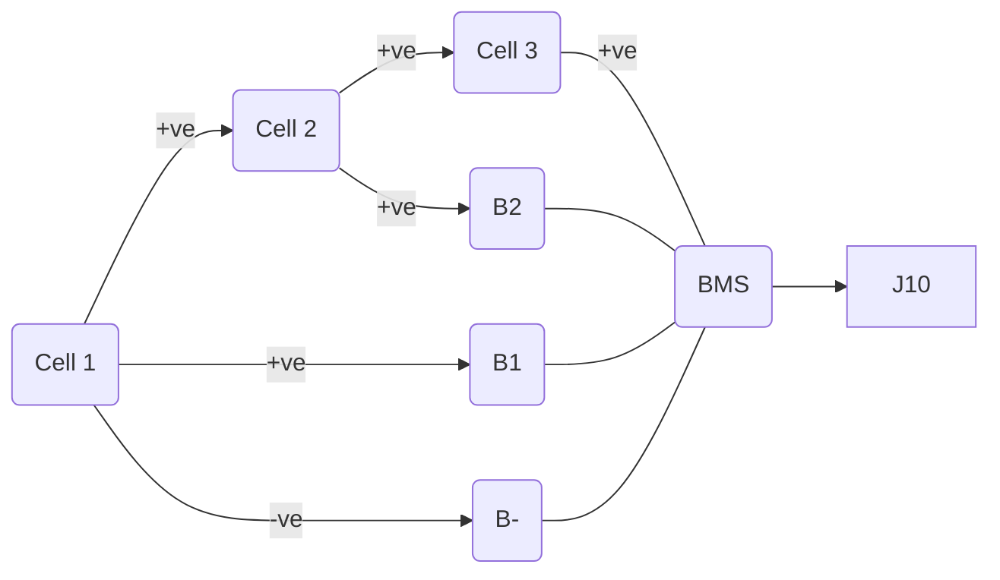
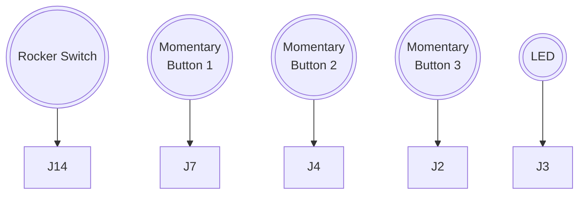
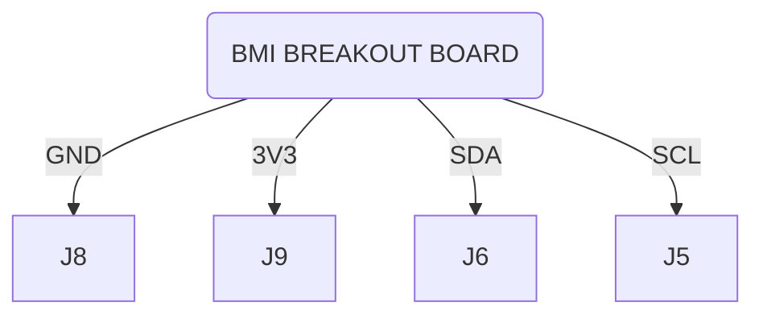
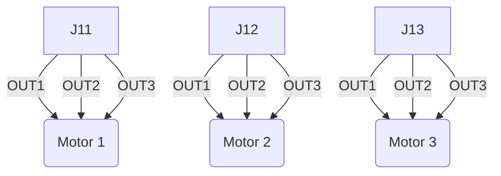

# Gimbal
later :p

Battery:

```mermaid
flowchart LR
    A(Cell 1)-->|+ve|B(Cell 2)-->|+ve|C(Cell 3)---|+ve|D
    A(Cell 1)-->|+ve|F(B1)---D
    A(Cell 1)-->|-ve|E(B-)---D(BMS)
    B(Cell 2)-->|+ve|G(B2)---D
    D-->J10
```

Handle wiring:

```mermaid
flowchart TD
    A@{ shape: dbl-circ, label: "Rocker Switch" }-->J14
    B@{ shape: dbl-circ, label: "Momentary
Button 1" }-->J7
    D@{ shape: dbl-circ, label: "Momentary
Button 2" }-->J4
    E@{ shape: dbl-circ, label: "Momentary
Button 3" }-->J2
    LED@{ shape: dbl-circ, label: "LED" }-->J3
```

BMI270 Breakout Board:

```mermaid
flowchart TD
    C(BMI BREAKOUT BOARD)-->|GND|J8
    C(BMI BREAKOUT BOARD)-->|3V3|J9
    C(BMI BREAKOUT BOARD)-->|SDA|J6
    C(BMI BREAKOUT BOARD)-->|SCL|J5
```

Motors:

```mermaid
flowchart TD
    J11-->|OUT1|D(Motor 1)
    J11-->|OUT2|D(Motor 1)
    J11-->|OUT3|D(Motor 1)

    J12-->|OUT1|E(Motor 2)
    J12-->|OUT2|E(Motor 2)
    J12-->|OUT3|E(Motor 2)

    J13-->|OUT1|F(Motor 3)
    J13-->|OUT2|F(Motor 3)
    J13-->|OUT3|F(Motor 3)
```
